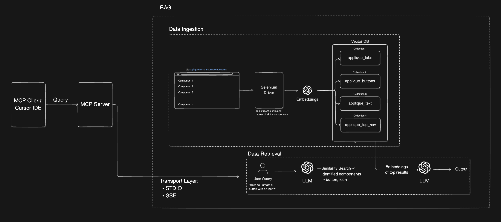
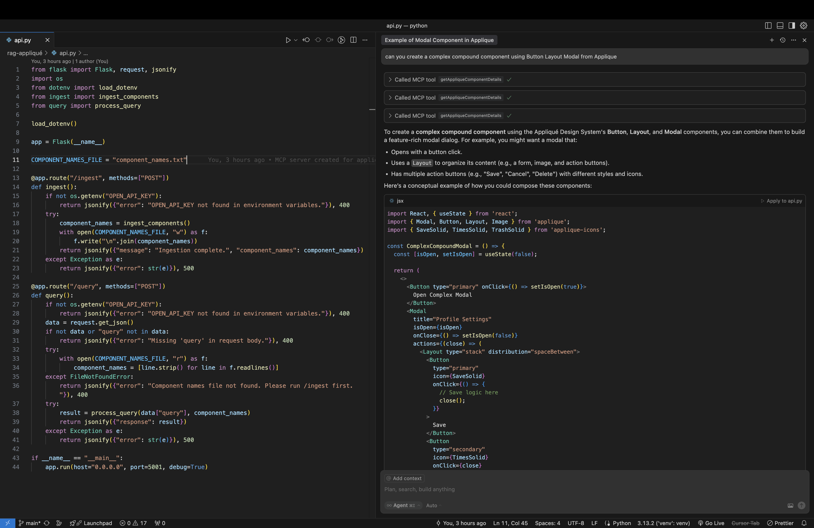

# RAG - Myntra Appliqué - Design System Documentation Assistant

## Architecture:



## Working Demo

[▶️ Watch the Demo Video of MCP Client-Server Interaction](https://drive.google.com/file/d/1gcgP5YXPLrxIgjqoiN2YhkbA8fKmucks/view?usp=sharing)



## Overview

Component Design System Link \~ [https://applique.myntra.com/components/accordion](https://applique.myntra.com/components/accordion)

A Retrieval-Augmented Generation (RAG) system for Myntra's Appliqué Design System documentation, providing intelligent answers about UI components.

## Overview

This project creates a virtual assistant that can answer queries about the Appliqué Design System components by:

1. **Scraping documentation**: Automatically extracts content from the Appliqué documentation website
2. **Processing content**: Organizes content by component and creates semantic embeddings
3. **Storing in vector database**: Uses Qdrant to store and retrieve component documentation
4. **Intelligent retrieval**: Routes queries to the most relevant component collections
5. **Generating responses**: Uses OpenAI's API to create natural language responses with code examples

## System Architecture

The system is divided into four main modules:

1. **Data Ingestion** (`ingest.py`): Scrapes the Appliqué documentation website, processes content, and stores in Qdrant

   - **Web Scraping**:

     - Uses Selenium (headless Chrome) to load documentation pages with JavaScript
     - Extracts component links from the Appliqué design system site
     - Scrapes detailed content from each component page including descriptions, code examples, API properties, and images

   - **Content Processing**:

     - Extracts component names from URLs
     - Organizes scraped content into structured documents
     - Adds metadata like URLs, timestamps, and content indicators

   - **Text Chunking**:

     - Splits long documents into smaller chunks (1000 characters with 200 character overlap)
     - Ensures chunks are appropriate size for embedding and retrieval

   - **Vector Database Creation**:

     - Creates a separate Qdrant collection for each component
     - Converts text chunks to embeddings using OpenAI's embedding model
     - Stores these vector embeddings in Qdrant for semantic search

2. **Query Processing** (`query.py`): Handles user queries, retrieves relevant documentation, and generates responses

   - **Query Routing System**:

     - Uses GPT-3.5 to analyze user questions and determine which component collections to search
     - Routes user queries to the most relevant component collections

   - **Vector Similarity Search**:

     - Converts user queries to embeddings
     - Performs semantic search against the Qdrant database

   - **Multi-Collection Searching**:

     - Searches across multiple components if necessary

   - **Answer Generation**:

     - Aggregates search results
     - Uses GPT-3.5 to generate structured responses with examples and API details

3. **Application Entry Point** (`app.py`): Command-line interface to run ingestion or queries

   - Handles modes for ingestion (`--ingest`) and querying (`--query`)
   - Provides direct search into Qdrant collections
   - Constructs prompts and manages API interactions

4. **MCP Client and Server Communication**

   This project integrates an **MCP (Model Context Protocol)** based communication layer between the **Cursor IDE (MCP Client)** and the **MCP Server**.

   - **MCP Client (Cursor IDE)**:

     - Sends queries through **STDIO transport**.
     - Communicates via standard input/output streams.

   - **MCP Server**:

     - Receives user queries via STDIO.
     - Processes the query through the RAG pipeline (similarity search + LLM generation).
     - Returns the response back to the MCP Client through STDIO.

   **Transport Layer Details**:

   - **STDIO (Standard I/O)**: Query and response via process pipes.
   - **SSE (Server-Sent Events)**: (Optional) for potential future real-time streaming responses.

> Using MCP with STDIO transport allows tight integration into the IDE, giving developers intelligent documentation retrieval and assistance inside their coding environment.

5. **Utils** (`utils.py`): Utility functions
   - Extracts component names from URLs
   - Formats collection names for Qdrant compatibility

## Usage

### Data Ingestion

To scrape and ingest the Appliqué documentation:

```bash
python app.py --ingest
```

### Querying the System

To ask a question about Appliqué components:

```bash
python app.py --query "How do I create a modal dialog in Appliqué?"
```

## How It Works

### Data Ingestion Process

1. Web Scraping using Selenium
2. Content Extraction of descriptions, code, and API properties
3. Document Processing into chunks
4. Embedding Generation using OpenAI
5. Storage in Qdrant collections

### Query Processing

1. Query Routing to determine relevant components
2. Vector Search across multiple collections
3. Context Building
4. Natural Language Response Generation

### MCP Communication (IDE Integration)

1. Cursor IDE sends query over STDIO
2. MCP Server processes and retrieves documentation
3. Response is returned back to Cursor IDE in real-time

## Customization

- Modify scraping source by changing the base URL in `ingest.py`
- Adjust chunk size and overlap settings
- Customize system prompts for response generation

## Example Queries

### Example 1:

```
➜ python app.py --query "How do I use <Layout> component in Appliqué?"
```

````
Processing query: How do I use <Layout> component in Appliqué?
Query routed to collections: ['applique_layout']
Found 2 results in collection 'applique_layout'

Query: How do I use <Layout> component in Appliqué?

Top results:

1. Component: layout
   URL: https://applique.myntra.com/components/layout
   Content preview: Component: layout
URL: https://applique.myntra.com/components/layout...

2. Component: layout
   URL: https://applique.myntra.com/components/layout
   Content preview: </Layout>
)
 return (
  <Layout type="row">
    <div style={{ padding: '16px', border: '1px solid' }}>One</div>
    <div style={{ padding: '16px', bor...

RAG Response:
1. **Brief explanation:** The `<Layout>` component in Myntra's Appliqué Design System is used to manage the arrangement and spacing of elements on a webpage. It helps in creating responsive layouts by providing flexibility in positioning different UI components.

2. **Key features and variations:**
   - The `type` prop defines the layout direction and can be set to "row" for a horizontal layout or "column" for a vertical layout.
   - The `spacing` prop can be used to set the spacing between the child elements.
   - The `<Layout>` component supports responsive design, making it easy to create layouts that adapt to different screen sizes.

3. **Code example:**
```jsx
import React from 'react';
import Layout from 'applique/components/layout';

const MyComponent = () => {
  return (
    <Layout type="row" spacing={16}>
      <div style={{ padding: '16px', border: '1px solid' }}>One</div>
      <div style={{ padding: '16px', border: '1px solid' }}>Two</div>
      <div style={{ padding: '16px', border: '1px solid' }}>Three</div>
      <div style={{ padding: '16px', border: '1px solid' }}>Four</div>
    </Layout>
  );
};

export default MyComponent;

4. **Important props or API details:**
   - `type`: Specifies the layout direction ("row" or "column").
   - `spacing`: Sets the spacing between child elements.

By using the `<Layout>` component and adjusting its props, you can easily create structured and visually appealing layouts in your web application.
````

### Example 2:

```
➜ python app.py --query "How do I use Layout with progress bar"
```

````
Processing query: How do I use Layout with progress bar
Query routed to collections: ['applique_layout', 'applique_progress']
Found 2 results in collection 'applique_layout'
Found 2 results in collection 'applique_progress'

Query: How do I use Layout with progress bar

Top results:

1. Component: layout
   URL: https://applique.myntra.com/components/layout
   Content preview: accordion avatar badge banner bread crumb buttons button button group click away dropdown dropdowns input select input date input month error boundary...

2. Component: layout
   URL: https://applique.myntra.com/components/layout
   Content preview: </Layout>
)
 return (
  <Layout type="row">
    <div style={{ padding: '16px', border: '1px solid' }}>One</div>
    <div style={{ padding: '16px', bor...

RAG Response:
### Layout Component
The Layout component in Myntra's Appliqué Design System allows you to structure your UI elements in a flexible and responsive way. It helps in arranging different components and controlling the layout effectively.

#### Key Features:
- Supports types like "stack" and "row" to define the layout orientation.
- Allows setting relative spacing between elements using the `space` prop.
- Facilitates arranging elements horizontally or vertically as per the type specified.

#### Practical Code Example:
To use Layout with a progress bar, you can structure your components inside a Layout component with a type that suits your design.

```jsx
import React from 'react';
import { Layout, Progress } from 'applique';

const ProgressBarLayout = () => {
  return (
    <Layout type="stack" space={[1, 2, 1]}>
      <Progress value={25} /> {/* Assuming the value is 25% */}
      <Progress value={50} /> {/* Progress at 50% */}
      <Progress value={75} /> {/* Progress at 75% */}
    </Layout>
  );
};

export default ProgressBarLayout;

In the code above, a stack Layout is used to vertically arrange Progress components, each showing different progress values.

#### Important API Details:
- `type`: Specifies the layout direction ("stack" or "row").
- `space`: Accepts an array to define relative spacing between elements.

By utilizing the Layout component with Progress components, you can create a structured and visually appealing layout for displaying progress bars in your application.
````

# MCP Configs

`mcp.json`

```json
{
  "mcpServers": {
    // STDIO Transport
    "applique-rag-stdio": {
      "command": "node",
      "args": [
        "/Users/rohangore/Documents/projects/python/rag-appliqué/mcp/stdio/index.js"
      ]
    },

    // SSE Transport
    "applique-rag-sse": {
      "url": "http://localhost:3001/sse"
    }
  }
}
```

# To connect Frontend with MCP Server
ref: https://ai-sdk.dev/docs/reference/ai-sdk-core/create-mcp-client#experimental_createmcpclient

```javascript
const mcpClient = await experimental_createMCPClient({
  transport: {
    type: "sse",
    url: "http://localhost:8081/sse",
  },
  name: "Order Service",
});
```