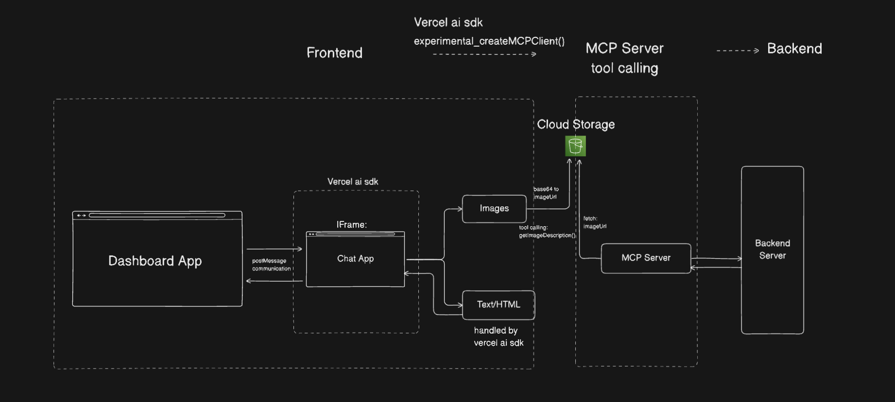

## FE to MCP Server Architecture:



[▶️ Watch the Demo Video of Chat Interaction](https://drive.google.com/file/d/1Evu24ItxcezhdoV-1LenzGx8ZVNfdzsX/view?usp=sharing)


### Parent Injects the Chat App into the Dashboard
```javascript
<script src="https://cdnjs.cloudflare.com/ajax/libs/html2canvas/1.4.1/html2canvas.min.js"></script>

<script>
// TO send html
window.addEventListener("message", function(event) {
  // Verify sender origin for security
  // if (event.origin !== 'http://localhost:5173') return;
  if (event.data.action === "REQUEST_HTML") {
    // Send the HTML back to the iframe
    event.source.postMessage(
      {
        html: document.body.innerText,
        type: "HTML",
      },
      "*"
    ); // Or specify exact target origin
  }

  if (event.data.action === "TAKE_SCREENSHOT") {
    html2canvas(document.documentElement, {
      allowTaint: true,
      useCORS: true,
      logging: false,
      scrollX: 0,
      scrollY: 0,
      windowWidth: document.documentElement.offsetWidth,
      windowHeight: document.documentElement.offsetHeight,
      height: document.documentElement.scrollHeight,
      width: document.documentElement.scrollWidth,
      onclone: function(clonedDoc) {
        // This captures elements with fixed positioning correctly
        clonedDoc.documentElement.style.overflow = "hidden";
      },
    }).then((canvas) => {
      const imageData = canvas.toDataURL("image/png");
      const iframe = document.getElementById("myIframe");
      console.log({ imageData });
      iframe.contentWindow.postMessage(
        {
          type: "SCREENSHOT",
          image: imageData,
        },
        "*"
      ); // Replace '*' with exact origin in production
    });
  }
});
</script>

<iframe id="myIframe" src="http://localhost:5173/" style="position: absolute; bottom:0; right:0; z-index: 50; border: none; height: 490px; width: 350px;"></iframe>
```


### Architecture Components

1. **Frontend**

   - Dashboard App: Main application container
   - Chat App: Embedded within an IFrame
   - Communication: Uses postMessage for secure cross-origin communication

2. **Vercel AI SDK Integration**

   - Handles experimental_createMCPClient() for MCP protocol implementation
   - Manages communication between Frontend and MCP Server

3. **MCP Server**

   - Handles two main types of content:
     - Images: Processes image-related requests
     - Text/HTML: Managed by Vercel AI SDK
   - Implements tool calling functionality
   - Communicates with Cloud Storage and Backend

4. **Cloud Storage**

   - Stores and manages images
   - Supports base64 to imageUrl conversion
   - Provides fetch functionality for image retrieval

5. **Backend Server**
   - Processes final requests
   - Handles business logic and data processing

### Flow

1. Dashboard App loads the Chat App in an IFrame
2. User interactions in Chat App communicate with Dashboard via postMessage
3. Requests are processed through Vercel AI SDK's MCP client
4. MCP Server handles requests based on content type:
   - Image requests interact with Cloud Storage
   - Text/HTML is processed directly
5. Processed requests are forwarded to Backend Server
6. Results are returned through the same chain back to the user interface

